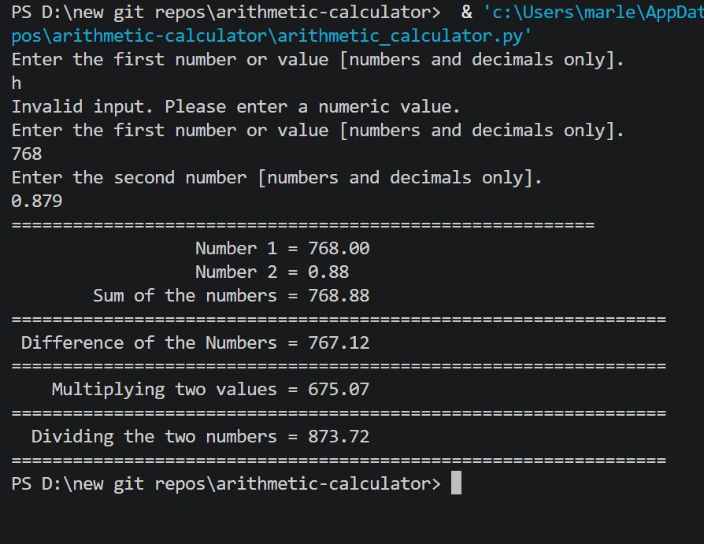

# 🧮 Arithmetic Calculator

A Python console application that performs all four basic arithmetic operations — addition, subtraction, multiplication, and division — on two user-entered numbers and displays the results in a clean right-aligned format.

---

## Features

- Accepts two numeric values as input (integers or decimals)
- Calculates: addition, subtraction, multiplication, and division
- Displays results in right-aligned formatted output
- Input validation — catches non-numeric entries and re-prompts
- Division-by-zero guard — displays a clear message instead of crashing

---

## How It Works

1. User enters two numbers
2. All four operations are calculated
3. Results are printed in a right-aligned formatted table
4. If the second number is zero, division displays "Cannot divide by zero"

---

## Example Output

```
Enter the first number or value [numbers and decimals only].
25
Enter the second number [numbers and decimals only].
5
=========================================================
                        Number 1 =  25.00
                        Number 2 =  5.00
               Sum of the numbers =  30.00
================================================================
         Difference of the Numbers =  20.00
================================================================
             Multiplying two values =  125.00
================================================================
           Dividing the two numbers =  5.00
================================================================
```

---

## Screenshot



---

## Technologies Used

- Python 3
- `format()` with `">29s"` — right-aligned text formatting
- `format()` with `",.2f"` — comma-separated number formatting
- `try/except` — input validation
- Division-by-zero guard

---

## Learning Outcomes

- Basic arithmetic operators in Python (`+`, `-`, `*`, `/`)
- Variables and data types (`float`)
- Right-aligned output using `format()` with `">Ns"` format spec
- Input validation with `try/except`
- Guard clauses (division by zero)

---

## How to Run

1. Make sure Python 3 is installed: https://www.python.org/downloads/
2. Clone or download this repo
3. Open a terminal in the repo folder
4. Run: `python arithmetic_calculator.py`
5. Follow the prompts

---

## Folder Structure

```
arithmetic-calculator/
├── arithmetic_calculator.py
├── output.png
├── README.md
├── LICENSE
└── .gitignore
```

---

## License

This project is licensed under the MIT License — see the [LICENSE](LICENSE) file for details.

---

*Written by Marlena Fabrick — Computer Programming, Fall 2020*
